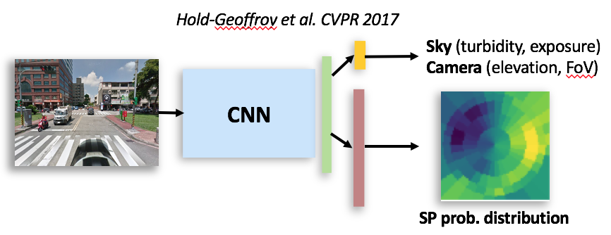

# Estimate Outdoor Illumination on Dash-cam images #
A re-implemented project which focus on dash-cam images
according to the paper (Deep Outdoor Illumination Estimation [Hold-Geoffroy et al. CVPR 2017]) ([https://arxiv.org/abs/1611.06403](https://arxiv.org/abs/1611.06403)). 
This project is an end-to-end system that outputs corresponding sun position and physcial 
sky, camera parameters by inputing single dash-cam image.



## Quick start ##
### Download weights ###
You can download the **weights** from [here](https://drive.google.com/file/d/1PPQEaYcIJ7l6lfa0FA9z-U1ngxc0wIQQ/view?usp=sharing) and 
our **dataset** from [here](https://drive.google.com/file/d/1rst68ECZJXMvh81Vi2DQbzXlWWMDNwzj/view?usp=sharing).

### Test ###
If you want to test your own image, run this command:
```bash
python inference.py --img_path <image-path> --pre-trained <weight-path>
```

### Training ###
You can generate the dataset and list by using ```generate_data.py ``` and 
the data (360 panorama images seperated into test and train) which followed the format in ```GS_skymodel.csv```.

After generating dataset, run command below for training:
```bash
python train.py
```
The trained weights will be stored as ```weights.pth``` .

### Evaluation ###
Evaluate the trained model on the test dataset (```data/test_list.csv```), it will output the average error of each predictions.

```bash
python eval.py --pre-trained <weight-path>
```

## Dependecies ##
* numpy
* skimage
* pytorch
* opencv-python
* progressbar
